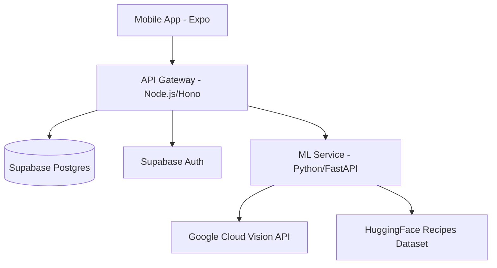

# Waste2Taste — Project Instructions

Minimize food waste through smart pantry management and recipe generation.

## Project Overview

Waste2Taste is a full-stack mobile application (Expo/React Native) that helps users track their ingredients and discover recipes based on what they already have. It uses AI for ingredient detection from photos and a microservice architecture for its backend.

### Architecture



- **Frontend:** Expo React Native app with file-based routing (`expo-router`).
- **API Gateway (`backend/api`):** Node.js service using Hono. Handles authentication, database CRUD, and proxies ML requests.
- **ML Service (`backend/ml`):** Python microservice using FastAPI. Handles ingredient detection (Vision API) and recipe recommendations (HuggingFace dataset).
- **Database:** Supabase Postgres with Row-Level Security (RLS) policies.

---

## 🛠 Tech Stack

- **Frontend:** React Native, Expo, TypeScript, Expo Router, React Context.
- **Backend API:** Node.js 20, Hono, TypeScript, Supabase Auth/Postgres.
- **ML Service:** Python 3.11, FastAPI, Google Cloud Vision, HuggingFace Datasets, Pandas, RapidFuzz.
- **Infrastructure:** Docker, Google Cloud Run, Google Secret Manager.

---

## 🚀 Getting Started

### 1. Root / Frontend Setup
```bash
npm install
npx expo start
```

### 2. Backend API Setup
```bash
cd backend/api
npm install
cp .env.example .env # Fill with Supabase credentials
npm run dev
```

### 3. ML Service Setup
```bash
cd backend/ml
python3 -m venv venv
source venv/bin/activate
pip install -r requirements.txt
cp .env.example .env # Fill with Google Cloud credentials
uvicorn main:app --port 8001
```

---

## 🧪 Development Conventions

### Testing
- **Backend API:** Uses `vitest`. Run with `npm test`.
- **ML Service:** Uses `pytest`. Run with `pytest`.
- **Frontend:** Unit tests should be placed in `__tests__` (TBD).

### Code Style
- **TypeScript:** Strict mode is enabled. Use interfaces/types for all API responses and component props.
- **Python:** Use Pydantic for request/response validation.
- **Database:** All schema changes must go through `backend/supabase/migrations/`.

### Documentation
- **Specs:** Architectural decisions and detailed designs are in `docs/superpowers/specs/`.
- **Plans:** Implementation roadmaps are in `docs/superpowers/plans/`.
- **READMEs:** Each major component (`backend/api`, `backend/ml`) has its own context.

---

## 📂 Key Files & Directories

- `app/`: Expo Router screens and layouts.
- `backend/api/src/routes/`: Hono API endpoints.
- `backend/ml/services/`: Core logic for Vision and Recommendations.
- `backend/supabase/migrations/`: Database schema definitions.
- `docs/superpowers/`: Project "source of truth" for design and plans.
- `data/catalog.ts`: Master ingredient catalog (synchronized with DB).

---

## ⚠️ Important Notes
- The ML service is designed to be **internal-only** in production. It should only be called by the Node.js API Gateway.
- Row-Level Security (RLS) is active on Supabase. Ensure all queries pass the user's JWT.
- Ingredient detection relies on the `GOOGLE_APPLICATION_CREDENTIALS` environment variable.
