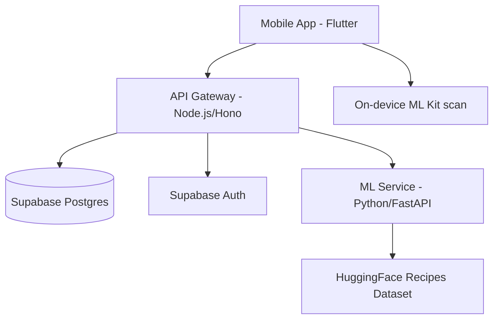
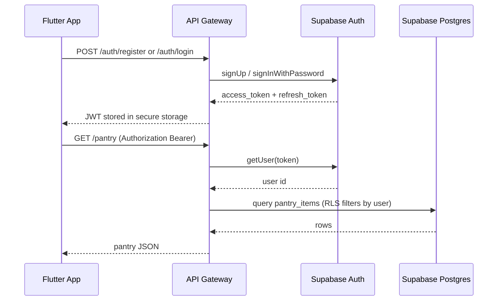
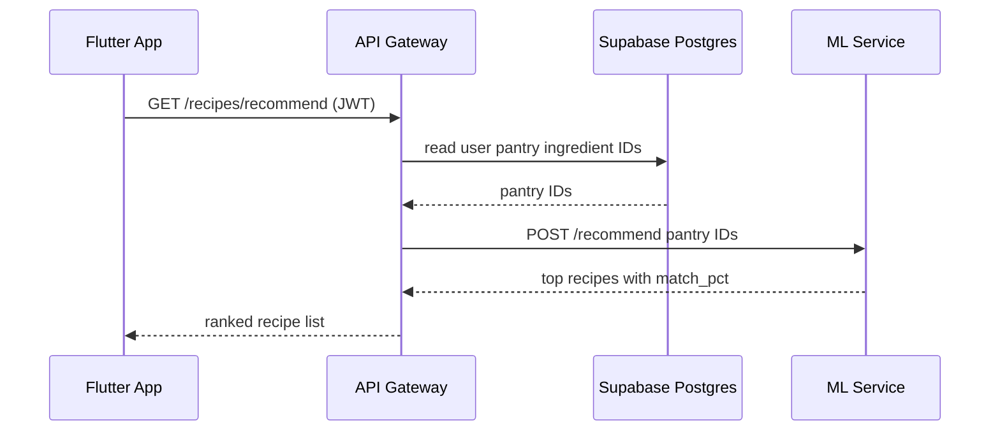
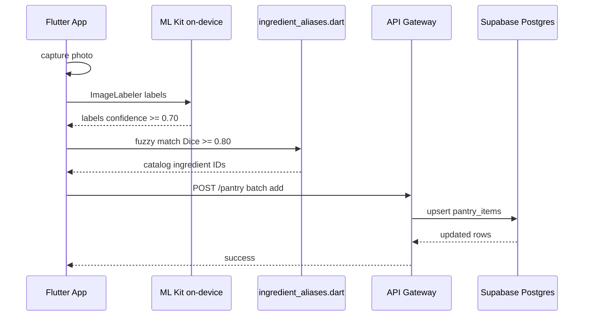
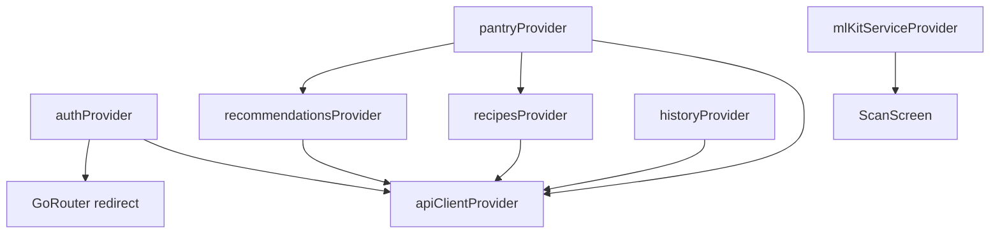

# Waste2Taste

Waste2Taste helps users track pantry ingredients and discover recipes based on what they already have. This repo is a monorepo with a Flutter mobile app, a Node.js API gateway, a Python ML service, and Supabase for auth and storage.

**Stack**

- **Mobile:** Flutter (`waste2taste_flutter/`) — Riverpod, GoRouter, on-device ML Kit scanning
- **API:** Hono + TypeScript (`backend/api/`) — auth, CRUD, ML proxy
- **ML:** FastAPI + Python (`backend/ml/`) — recipe ranking from HuggingFace dataset
- **Data:** Supabase Postgres + Auth

---

## Prerequisites

| Tool | Version | Used for |
|------|---------|----------|
| Flutter SDK | ≥ 3.10 | Mobile app |
| Node.js | ≥ 20 | API gateway (`backend/api/`) |
| Python | ≥ 3.11 | ML service (`backend/ml/`) |
| Docker & Compose | latest | Recommended for local backend |

---

## Quick start

### 1. Configure environment

```bash
cp backend/api/.env.example backend/api/.env
cp backend/ml/.env.example backend/ml/.env
```

Fill in Supabase credentials in `backend/api/.env`. For the ML service, set `GOOGLE_APPLICATION_CREDENTIALS` if you use the legacy cloud `/detect` path (Flutter uses on-device ML Kit instead).

Apply migrations in `backend/supabase/migrations/` to your Supabase project before seeding.

### 2. Start the backend (Docker — recommended)

```bash
cd backend
docker compose up --build
```

API available at `http://localhost:8080`.

**Alternative: run services separately**

```bash
# Terminal 1 — API gateway
cd backend/api && npm install && npm run dev

# Terminal 2 — ML service
cd backend/ml
python3 -m venv venv && source venv/bin/activate
pip install -r requirements.txt
uvicorn main:app --port 8001
```

### 3. Seed the database

After migrations are applied:

```bash
cd backend/api
npm install
npm run seed
```

### 4. Run the Flutter app

```bash
cd waste2taste_flutter
flutter pub get
```

Pass the API URL with `--dart-define=API_URL=...`:

```bash
# Android emulator (host localhost → 10.0.2.2)
flutter run -d android --dart-define=API_URL=http://10.0.2.2:8080

# iOS simulator
flutter run -d iphone --dart-define=API_URL=http://127.0.0.1:8080
```

---

## Architecture

Three-tier layout: the Flutter app talks only to the API gateway; the ML service is internal-only (no public ingress). See [docs/architecture.md](docs/architecture.md) for deployment topology and security boundaries.

### System overview

| Component | Location | Role |
|-----------|----------|------|
| Flutter app | `waste2taste_flutter/` | Mobile UI; on-device ingredient scan via ML Kit |
| API gateway | `backend/api/` | Auth, CRUD, ML proxy; sole public backend entry |
| ML service | `backend/ml/` | Recipe recommendation; called only via API |
| Supabase | hosted | Postgres + JWT auth; RLS on user-owned tables |



### Authentication

Supabase issues JWTs. The API validates tokens with the anon-key client; the service-role client handles DB queries and must filter by `user_id`.



### Recipe recommendation

Pantry ingredient IDs are sent to the ML service; recipes are ranked by overlap with the cached HuggingFace dataset.



### Ingredient scan (Flutter)

Active path uses on-device ML Kit — no cloud Vision call. Labels are fuzzy-matched to catalog IDs and written to the pantry via the API.



### Flutter state (Riverpod)

Provider dependency chain from auth through pantry to recipes and history.



---

## Testing

```bash
# API gateway
cd backend/api && npm test

# ML service
cd backend/ml && source venv/bin/activate && pytest

# Flutter
cd waste2taste_flutter && flutter analyze && flutter test
```

---

## Repository layout

```
waste2taste/
├── waste2taste_flutter/       # Active Flutter app
│   └── lib/data/              # Local catalog + scan aliases
├── backend/
│   ├── api/                   # Hono gateway + seed script
│   ├── ml/                    # FastAPI recommendation service
│   └── supabase/migrations/   # Postgres schema + RLS
└── docs/                      # Architecture, API, DB, frontend guides
```

---

## Documentation

| Document | Description |
|----------|-------------|
| [Docs index](docs/README.md) | Full documentation table of contents |
| [Architecture](docs/architecture.md) | Deployment topology, security, data flows |
| [Contributing](docs/contributing.md) | Catalog sync, commit conventions, workflows |
| [Flutter frontend](docs/frontend/flutter.md) | App structure and providers |
| [API reference](docs/backend/api-integrations.md) | Routes and integrations |
| [Database](docs/backend/database.md) | Schema, RLS, migrations |
| [Deployment](backend/DEPLOY.md) | Cloud Run deployment |

---

## Contributing

See [CONTRIBUTING.md](CONTRIBUTING.md) and [docs/contributing.md](docs/contributing.md) for catalog updates, test expectations, and pull request guidelines.
