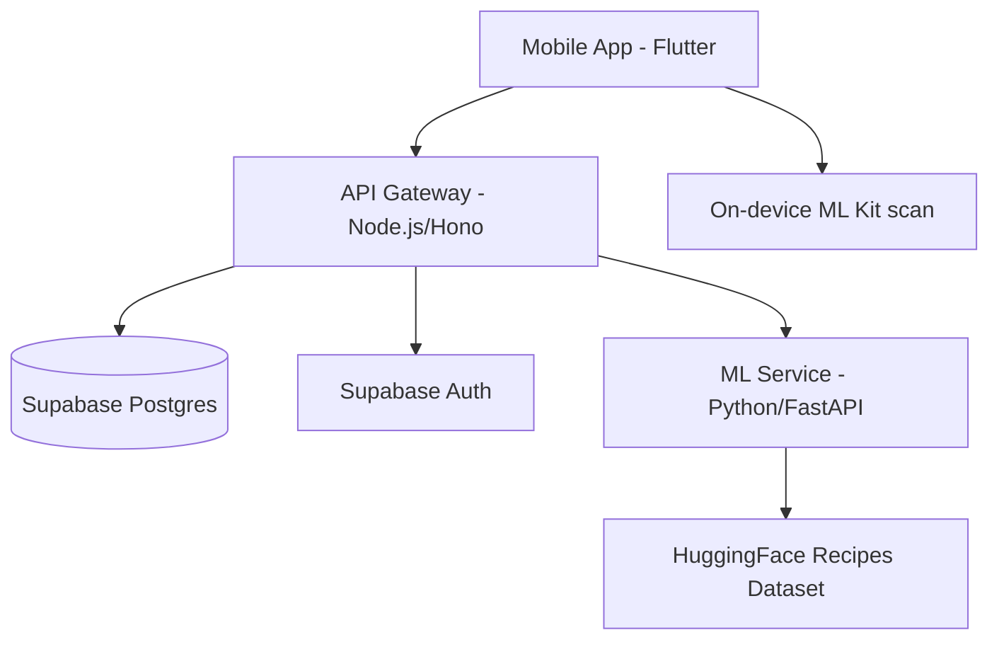
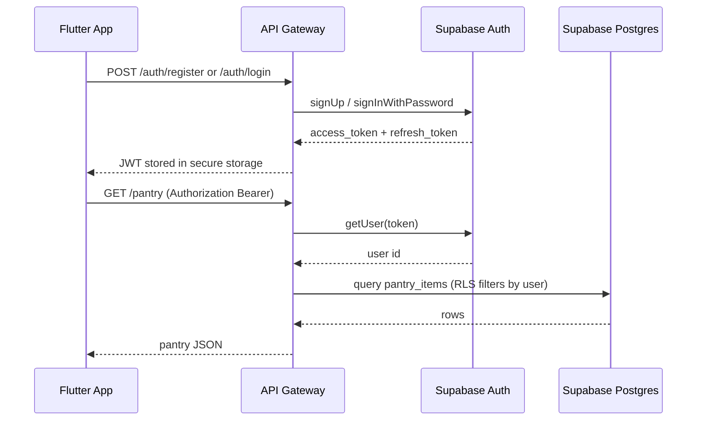
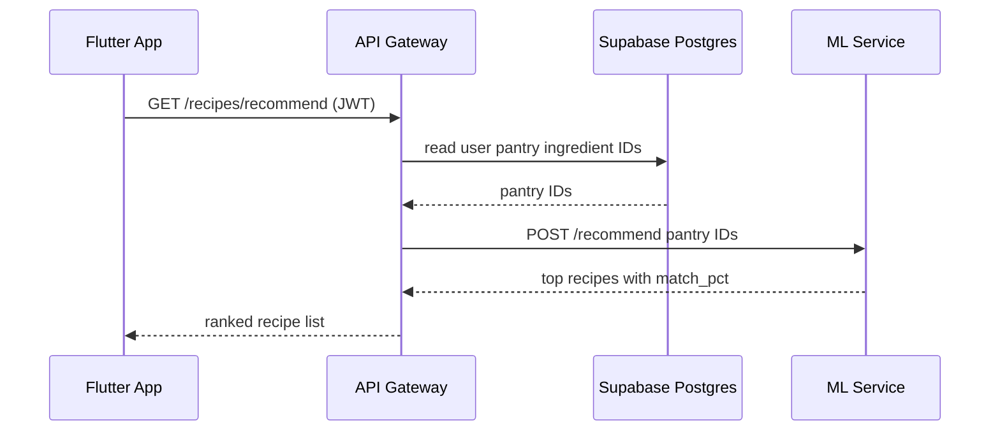
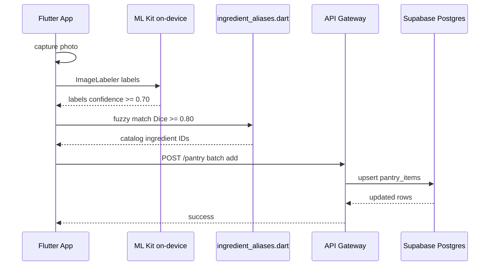
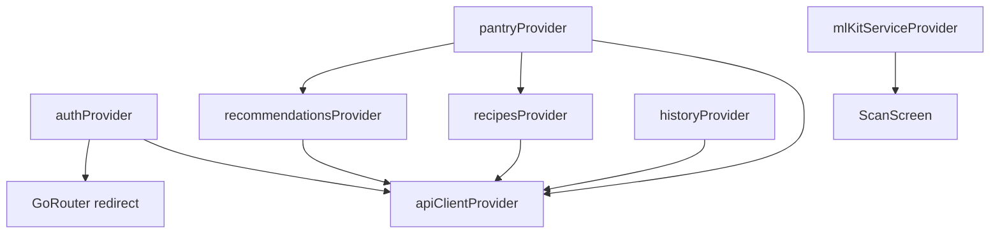

# Waste2Taste

Minimize food waste through smart pantry management and AI-powered recipe generation.

Waste2Taste is a full-stack application that helps users track their ingredients and discover recipes based on what they already have. It features a Flutter mobile app, a Node.js API gateway, and a Python-based ML microservice for recipe ranking.

---

## System Architecture



- **Frontend:** Flutter mobile app in `waste2taste_flutter/` with Riverpod, GoRouter, and on-device ML Kit scanning.
- **API Gateway (`backend/api`):** Node.js service using Hono. Handles auth, CRUD, and proxies ML requests.
- **ML Service (`backend/ml`):** Python microservice using FastAPI. Recommends recipes from the `junwatu/indonesian-recipes` dataset and is called only through the API gateway.

See [docs/architecture.md](docs/architecture.md) for deployment topology and security boundaries.

### Authentication flow



### Recipe recommendation flow



### Ingredient scan flow (Flutter)



### Flutter provider graph



---

## Prerequisites

| Tool | Version | Used for |
|------|---------|----------|
| Flutter SDK | ≥ 3.10 | Mobile app |
| Node.js | ≥ 20 | API gateway (`backend/api/`) |
| Python | ≥ 3.11 | ML service (`backend/ml/`) |
| Docker & Compose | latest | Optional full-stack local run |

---

## Setup & Installation

### 1. Backend Setup

The easiest way to run the backend services (API + ML) is using Docker Compose.

1. **Configure environment variables:**
   - Create `backend/api/.env` based on `backend/api/.env.example`.
   - Create `backend/ml/.env` based on `backend/ml/.env.example`.
   - Ensure you have your **Supabase** credentials and a **Google Cloud** service account JSON key.

2. **Start services:**
   ```bash
   cd backend
   docker compose up --build
   ```
   The API will be available at `http://localhost:8080`.

#### (Alternative) Manual Backend Setup

**API Gateway:**
```bash
cd backend/api
npm install
npm run dev
```

**ML Service:**
```bash
cd backend/ml
python3 -m venv venv
source venv/bin/activate
pip install -r requirements.txt
uvicorn main:app --port 8001
```

### 2. Flutter Setup

1. **Install dependencies:**
   ```bash
   cd waste2taste_flutter
   flutter pub get
   ```

2. **Configure API URL:**
   Pass the API gateway URL with `--dart-define=API_URL=...`.
   Use `http://10.0.2.2:8080` for Android emulator local dev and `http://127.0.0.1:8080` for iOS simulator local dev.

3. **Start the app:**
   ```bash
   flutter run -d android --dart-define=API_URL=http://10.0.2.2:8080
   ```

---

## Testing

### Backend API
```bash
cd backend/api
npm test
```

### ML Service
```bash
cd backend/ml
source venv/bin/activate
pytest
```

### Flutter
```bash
cd waste2taste_flutter
flutter analyze
flutter test
```

---

## Project Structure

```
waste2taste/
├── waste2taste_flutter/   Flutter mobile app
├── backend/
│   ├── api/               Node.js API Gateway (Hono)
│   ├── ml/                Python ML Microservice (FastAPI)
│   └── supabase/migrations/
└── docs/                  Documentation
```

---

## Documentation

| Document | Description |
|----------|-------------|
| [Docs index](docs/README.md) | Full documentation table of contents |
| [Architecture](docs/architecture.md) | System design and data-flow diagrams |
| [Contributing](docs/contributing.md) | Setup, tests, catalog sync |
| [Flutter frontend](docs/frontend/flutter.md) | App structure and providers |
| [API reference](docs/backend/api-integrations.md) | Routes and integrations |
| [Database](docs/backend/database.md) | Schema, RLS, migrations |
| [Deployment](backend/DEPLOY.md) | Cloud Run deployment |

---

## Contributing

See [CONTRIBUTING.md](CONTRIBUTING.md) and [docs/contributing.md](docs/contributing.md).
