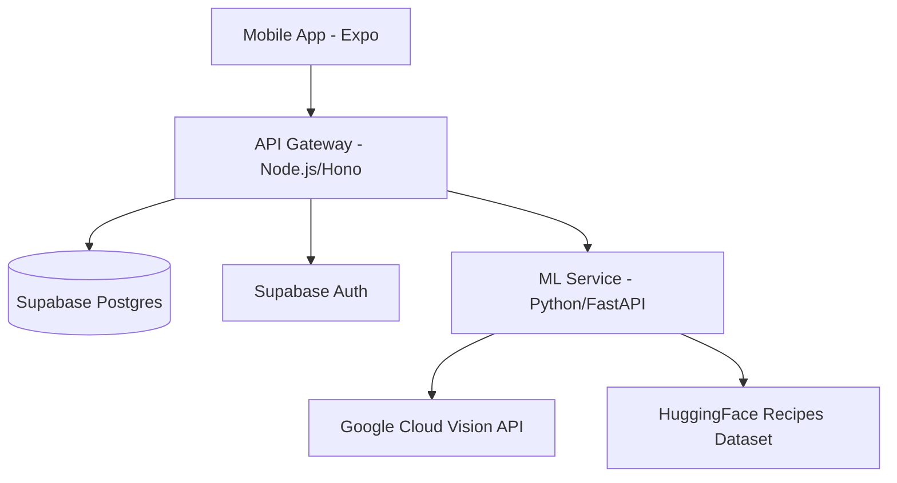

# Waste2Taste

Minimize food waste through smart pantry management and AI-powered recipe generation.

Waste2Taste is a full-stack application that helps users track their ingredients and discover recipes based on what they already have. It features a React Native mobile app, a Node.js API gateway, and a Python-based ML microservice for ingredient detection and recipe ranking.

---

## 🏗 System Architecture



- **Frontend:** Expo/React Native mobile app with file-based routing.
- **API Gateway (`backend/api`):** Node.js service using Hono. Handles auth, CRUD, and proxies ML requests.
- **ML Service (`backend/ml`):** Python microservice using FastAPI. Wraps Google Vision for photo scanning and recommends recipes from the `junwatu/indonesian-recipes` dataset.

---

## 🚀 Prerequisites

Ensure you have the following installed:
- **Node.js** (v20 or later)
- **Python** (v3.11 or later)
- **Docker** & **Docker Compose**
- **Expo Go** app (for mobile testing)

---

## 🛠 Setup & Installation

### 1. Backend Setup

The easiest way to run the backend services (API + ML) is using Docker Compose.

1.  **Configure Environment Variables:**
    - Create `backend/api/.env` based on `backend/api/.env.example`.
    - Create `backend/ml/.env` based on `backend/ml/.env.example`.
    - Ensure you have your **Supabase** credentials and a **Google Cloud** service account JSON key.

2.  **Start Services:**
    ```bash
    cd backend
    docker compose up --build
    ```
    The API will be available at `http://localhost:8080`.

#### (Alternative) Manual Backend Setup

If you prefer to run services manually for debugging:

**API Gateway:**
```bash
cd backend/api
npm install
npm run dev
```

**ML Service:**
```bash
cd backend/ml
python3 -m venv venv
source venv/bin/activate
pip install -r requirements.txt
uvicorn main:app --port 8001
```

### 2. Frontend Setup

1.  **Install dependencies:**
    ```bash
    npm install
    ```

2.  **Configure API URL:**
    Create a `.env` in the root directory (based on `.env.example`) and set:
    ```
    EXPO_PUBLIC_API_URL=http://localhost:8080
    ```

3.  **Start the app:**
    ```bash
    npx expo start
    ```
    Scan the QR code with **Expo Go** or press `w` for the web version.

---

## 🧪 Testing

### Backend API
```bash
cd backend/api
npm test
```

### ML Service
```bash
cd backend/ml
source venv/bin/activate
pytest
```

---

## 📂 Project Structure

- `app/`: Expo Router file-based navigation and screens.
- `backend/api/`: Node.js API Gateway (Hono).
- `backend/ml/`: Python ML Microservice (FastAPI).
- `backend/supabase/migrations/`: SQL database schema.
- `components/`: Reusable React Native UI components.
- `docs/superpowers/`: Detailed architecture specs and implementation plans.
