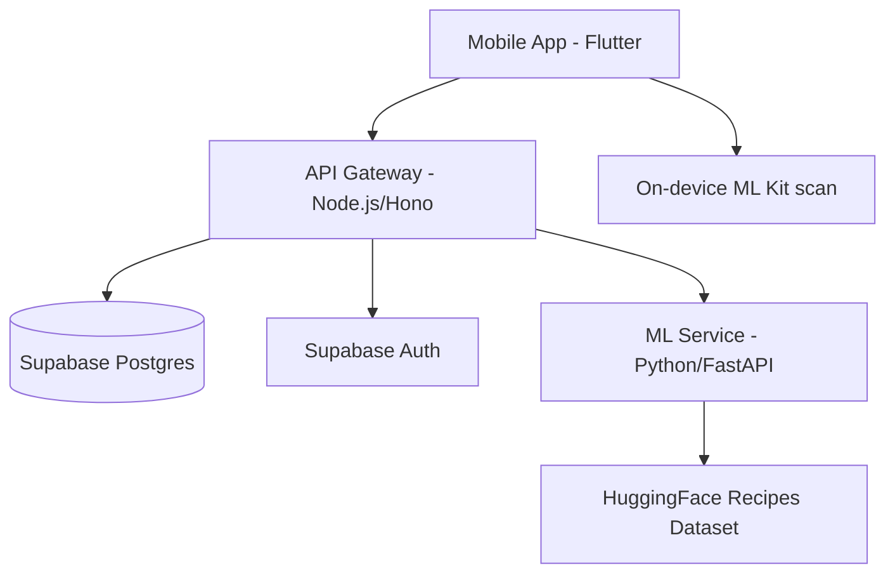
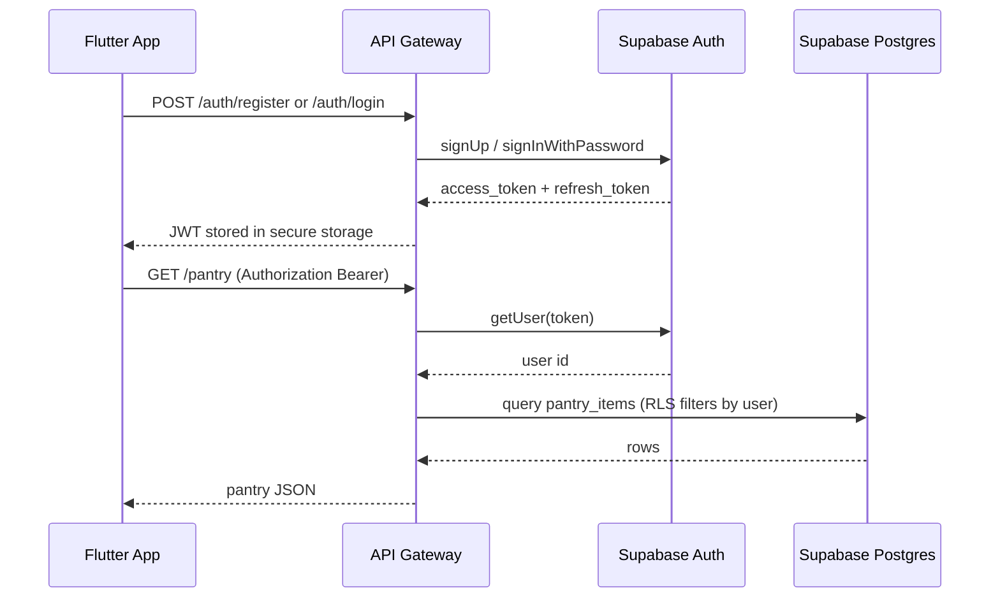
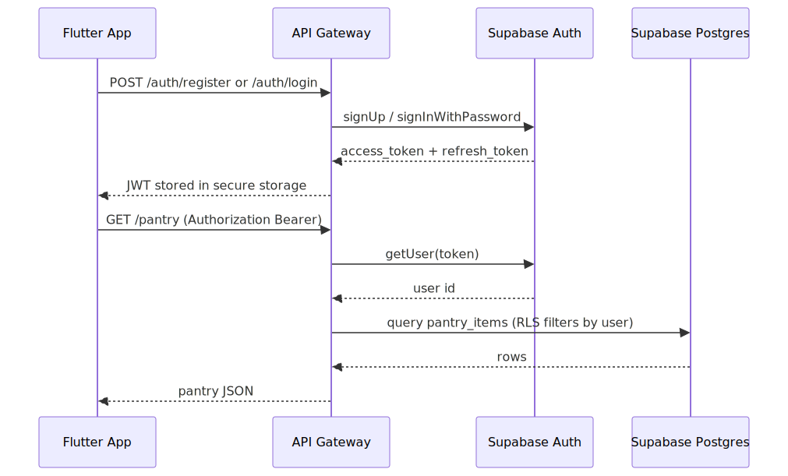
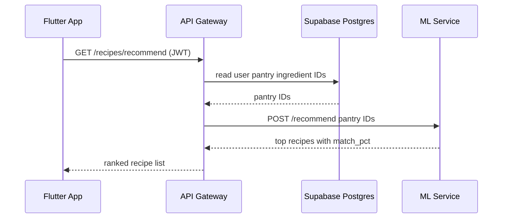
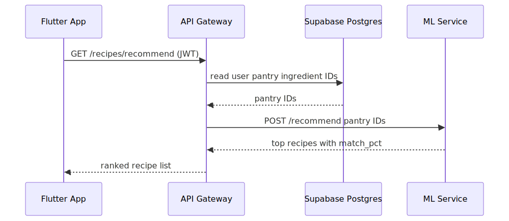
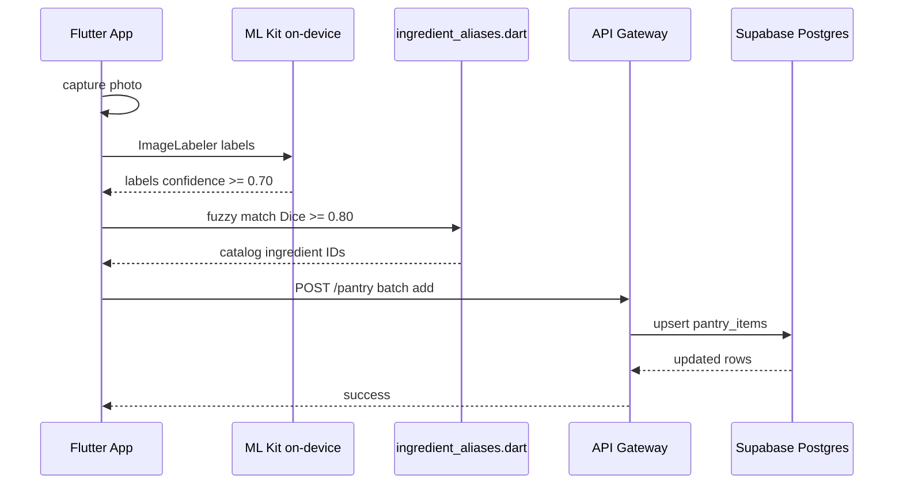
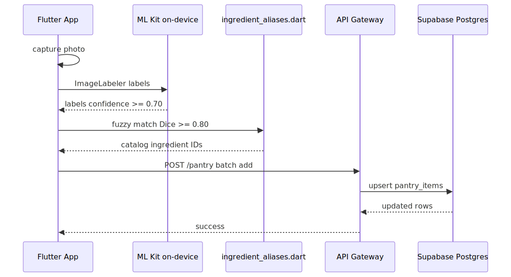

# Architecture — Waste2Taste

Waste2Taste is a three-tier system: a Flutter mobile app, a Node.js API gateway, and an internal Python ML service backed by Supabase.

For route-level detail see [API & integrations](backend/api-integrations.md). For schema detail see [Database](backend/database.md).

---

## System context





### Components

| Component | Location | Role |
|-----------|----------|------|
| Flutter app | `waste2taste_flutter/` | User-facing mobile UI; on-device ingredient scan via ML Kit |
| API gateway | `backend/api/` | Auth, CRUD, ML proxy; only public backend entry point |
| ML service | `backend/ml/` | Recipe recommendation from HuggingFace dataset; Vision API for legacy `/detect` |
| Supabase | hosted | Postgres + Auth (JWT); RLS on user-owned tables |

The ML service is **never directly reachable** from the internet. All client traffic goes through the API gateway.

---

## Deployment topology

```
Internet
   │
   ▼
Cloud Run (API gateway) ──public ingress──► Flutter app
   │
   ├── Supabase (Postgres + Auth)
   │
   └── VPC ──► Cloud Run (ML service, internal-only)
                    │
                    └── HuggingFace dataset (startup cache)
```

In local development, `docker compose up` from `backend/` runs the API on `:8080` and ML on `:8001`.

---

## Authentication flow

Supabase issues JWTs. The API validates tokens on every protected route using the anon-key client — no custom JWT signing.





**Two Supabase clients in the API:**

| Client | Key | Purpose |
|--------|-----|---------|
| Anon client | `SUPABASE_ANON_KEY` | Auth operations only (`signUp`, `signIn`, `getUser`) |
| Service-role singleton | `SUPABASE_SERVICE_ROLE_KEY` | Server-side DB queries (bypasses RLS — must filter by `user_id`) |

---

## Recipe recommendation flow

Recommendations score recipes by ingredient overlap between the user's pantry and each recipe in the HuggingFace dataset.





The ML service loads `junwatu/indonesian-recipes` into memory at startup (~3–5 s cold start). All `/recommend` calls use the cached DataFrame — no per-request network fetch.

---

## Ingredient scan flow (Flutter)

The active Flutter app uses **on-device ML Kit**, not the cloud Vision API. Scan results are matched against `ingredient_aliases.dart` and written to the pantry via the API.





Thresholds match the Python Vision service: confidence **0.70**, alias similarity **0.80**.

---

## Security boundaries

- **RLS** on `pantry_items` and `cooked_meals` — users can only read/write their own rows when using a user JWT through Supabase directly.
- **Service-role client** in the API bypasses RLS — route handlers must always filter by authenticated `user_id`.
- **ML service** has no public ingress; only the API gateway can call it via `ML_SERVICE_URL`.
- **Secrets** (`SUPABASE_*`, `GOOGLE_APPLICATION_CREDENTIALS`) must never be committed. See `.env.example` files.

---

## Catalog data

Ingredient and recipe catalog data lives in two places that must be kept in sync manually:

1. `backend/api/scripts/seed.ts` — seeds Supabase `ingredients` and `recipes` tables
2. `waste2taste_flutter/lib/data/catalog.dart` — local display catalog for offline UI

See [Contributing](contributing.md) for the update workflow.
