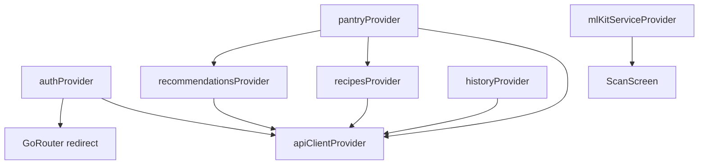

# Flutter Frontend — Waste2Taste

The active mobile app lives in `waste2taste_flutter/`. It uses Material 3, Riverpod for state, GoRouter for navigation, and Google ML Kit for on-device ingredient scanning.

For system-level architecture see [Architecture](../architecture.md). For API routes see [API & integrations](../backend/api-integrations.md).

---

## Stack

| Layer | Technology |
|-------|------------|
| UI | Flutter Material 3 (`ColorScheme.fromSeed`, seed `#AB2A02`) |
| State | Riverpod `AsyncNotifierProvider` |
| Navigation | GoRouter with `StatefulShellRoute` tab shell |
| HTTP | Dio + JWT interceptor |
| Auth storage | `flutter_secure_storage` |
| Scan | `google_mlkit_image_labeling` + `string_similarity` |

The app talks **only** to the Hono API gateway. It does not call Supabase or the ML service directly.

---

## Directory layout

```
waste2taste_flutter/lib/
  main.dart                 ProviderScope + MaterialApp.router
  router.dart               GoRouter — routes + auth redirect
  theme.dart                M3 theme + AppThemeExtension
  models/                   freezed + json_serializable models
  data/
    catalog.dart            UI ingredient/recipe catalog
    ingredient_aliases.dart ML Kit label → catalog ID mapping
  services/
    api_client.dart         Dio client + AuthInterceptor
    ml_kit_service.dart     ImageLabeler + fuzzy alias match
    storage_service.dart    JWT secure storage
  providers/                Riverpod notifiers (auth, pantry, recipes, history)
  widgets/                  Reusable UI components
  screens/                  Feature screens
```

---

## Provider graph

Riverpod providers form a dependency chain from auth through pantry to recipes and history.




| Provider | Responsibility |
|----------|----------------|
| `authProvider` | JWT bootstrap, login, signup, logout |
| `pantryProvider` | Pantry CRUD with optimistic updates and rollback |
| `recipesProvider` | Full recipe catalog from API |
| `recommendationsProvider` | Pantry-aware recommendations; recomputes when pantry changes |
| `historyProvider` | Cooked meal log |

---

## Navigation

Four tabs in a `StatefulShellRoute.indexedStack`: Home, Recipes, History, Profile. Feature screens (add ingredients, scan, recipe detail) push on top without the tab bar.

| Path | Screen |
|------|--------|
| `/` | Landing |
| `/login`, `/signup` | Auth |
| `/app/home` | Home (tab 0) |
| `/app/recipes` | Recipes (tab 1) |
| `/app/history` | History (tab 2) |
| `/app/profile` | Profile (tab 3) |
| `/app/add-ingredients` | Manual ingredient picker |
| `/app/scan` | Camera + ML Kit scan |
| `/app/recipe/:id` | Recipe detail |

`GoRouter.redirect` checks `authProvider.isLoading` during JWT bootstrap to avoid redirect flash.

---

## ML Kit scan pipeline

1. Request camera permission
2. Capture image (or demo mode with mock labels)
3. `ImageLabeler` returns labels with confidence ≥ **0.70**
4. Each label fuzzy-matched against `ingredient_aliases.dart` (Dice coefficient ≥ **0.80**)
5. Matched catalog IDs sent to `pantryProvider.addIngredients()`
6. Recommendations auto-recompute via provider dependency

ML Kit was chosen over the cloud Vision API for offline operation, no GCP credentials on device, and lower latency for common pantry items.

---

## Local development

```bash
cd waste2taste_flutter
flutter pub get
dart run build_runner build --delete-conflicting-outputs
flutter analyze
flutter test
flutter run -d android --dart-define=API_URL=http://10.0.2.2:8080
flutter run -d iphone --dart-define=API_URL=http://127.0.0.1:8080
```

| Target | API URL |
|--------|---------|
| Android emulator | `http://10.0.2.2:8080` |
| iOS simulator | `http://127.0.0.1:8080` |
| Production | Deployed Cloud Run API URL |

---

## Code generation

Models use Freezed + `json_serializable`. Regenerate after model changes:

```bash
dart run build_runner build --delete-conflicting-outputs
```

Generated files (`*.freezed.dart`, `*.g.dart`) are committed to the repo.
